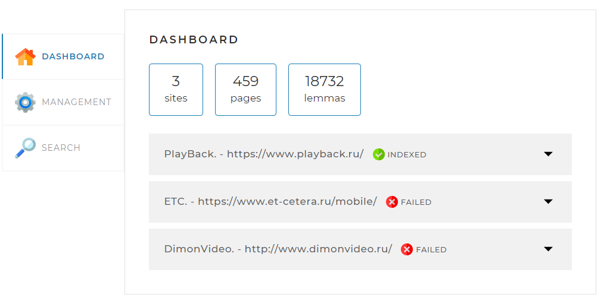
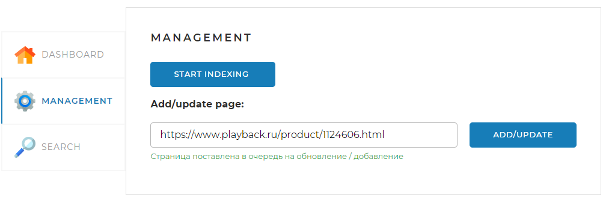
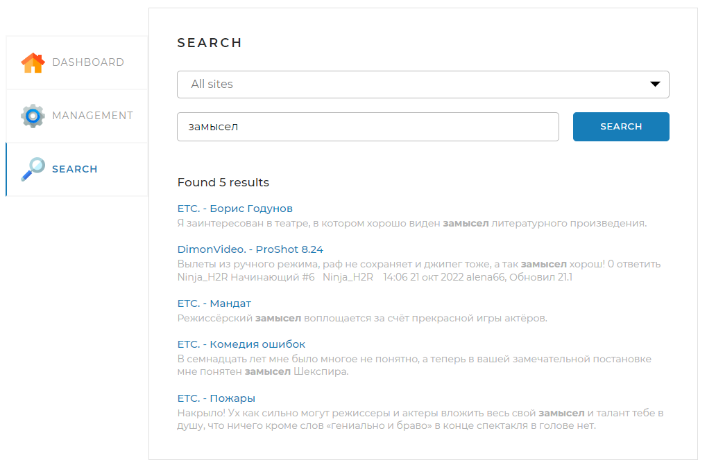
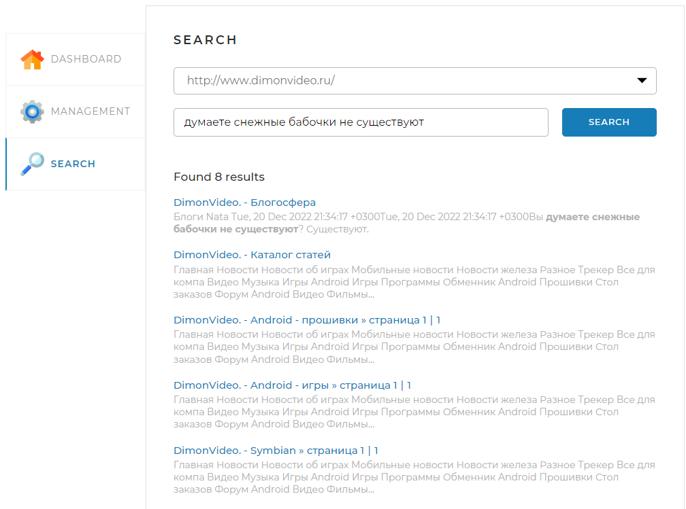

<h1 align ="center">SearchEngine</h1>

___
<p align="center">
  
</p>

___

## Description

**SearchEngine** is a final course project created to consolidate the knowledge acquired during the course.

Project is based on the Spring framework with interaction with a relational database.

___

## How To Use and Functional

* Set list of sites to be indexed in *application.yaml*

```yaml
indexing-settings:
  sites:
    - url: https://www.skillbox.ru/
      name: SkillBox.
```

* Access to the program interface is carried out through *localhost:8080*.
    * To choose list of sites from application file use *localhost:8080/api*.
    * In **Dashboard** tab you get statistic about indexed sites.
  <p align="center">
  
  </p>

    * In **Management** tab you can start indexing sites and add or update a certain page of your site list.
  <p align="center">
  
  </p>

    * In **Search** tab you can find page from indexed pages from
        * Short queries:
  <p align="center">
  
  </p>

    * And long queries from certain site:
    <p align="center">
  
  </p>

___

## Libraries

* org.apache.maven.plugins
    * maven-compiler-plugin
* org.springframework.boot
    * spring-boot-starter-parent
    * spring-boot-starter-web
    * spring-boot-starter-thymeleaf
    * spring-boot-starter-data-jpa
* org.projectlombok
    * lombok
* mysql
    * mysql-connector-java
* org.jsoup
    * jsoup
* org.apache.lucene.morphology
    * morph
    * morphology
    * dictionary-reader
    * english
    * russian
* skillbox-gitlab
    * https://gitlab.skillbox.ru/api/v4/projects/263574/packages/maven

___

## Project setup

DB setup is configured via file *application.yaml*

```yaml
spring:
  datasource:
    username: root
    password: root
    url: jdbc:mysql://localhost:3306/search_engine?useSSL=false&requireSSL=false&allowPublicKeyRetrieval=true
  jpa:
    properties:
      hibernate:
        jdbc.batch_size: 20
        order_inserts: true
        order_updates: true
        jdbc.batch_versioned_data: true
        dialect: org.hibernate.dialect.MySQL8Dialect
    hibernate:
      ddl-auto: update
```

Via powershell:

```
mvn package

java -jar target/searchengine-1.0-snapshot.jar
```

Via docker

Or via your DE.

___

## Future scope

* Indexing sites with english language


